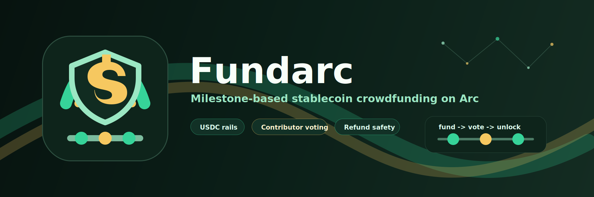

# Fundarc



Fundarc is a stablecoin-native crowdfunding dApp built for Arc Testnet. It lets creators raise USDC through milestone-based campaigns, while funders keep governance power over when each tranche of funds is unlocked.

Instead of releasing all funds at once, Fundarc splits a campaign into milestones. Contributors fund the campaign with USDC, creators submit milestone evidence, contributors vote with contribution-weighted voting power, and only approved milestones unlock funds for the creator. If a campaign is canceled or fails a milestone vote, funders can claim refunds.

## Table of Contents

- [Overview](#overview)
- [Core Features](#core-features)
- [How Fundarc Works](#how-fundarc-works)
- [Project Structure](#project-structure)
- [Tech Stack](#tech-stack)
- [Smart Contracts](#smart-contracts)
- [Frontend](#frontend)
- [Environment Variables](#environment-variables)
- [Local Development](#local-development)
- [Contract Development](#contract-development)
- [Contract Deployment](#contract-deployment)
- [Frontend Deployment](#frontend-deployment)
- [Key User Flows](#key-user-flows)
- [Security Notes](#security-notes)
- [Known Limitations](#known-limitations)
- [Roadmap Ideas](#roadmap-ideas)
- [License](#license)

## Overview

Fundarc is designed for transparent, accountable project funding. It is useful for open-source grants, creator campaigns, community initiatives, public goods, hackathon projects, and any funding process where contributors should have visibility and control over fund release.

The protocol has two major parts:

1. **Smart contracts** in `contracts/`
   - `FundarcFactory` deploys campaign contracts and manages protocol fees.
   - `FundarcCampaign` holds USDC, tracks contributions, manages milestone voting, unlocks funds, and processes refunds.

2. **Frontend application** in `frontend/`
   - A Next.js app for creating campaigns, contributing USDC, voting on milestones, withdrawing unlocked funds, claiming refunds, and viewing protocol metrics.

## Core Features

- **USDC-based crowdfunding**
  Campaigns accept ERC-20 USDC contributions instead of volatile native-token funding.

- **Milestone funding**
  Creators define one or more milestone amounts during campaign creation.

- **Contribution-weighted voting**
  Contributors vote on milestone approval using the amount they contributed as voting weight.

- **Creator evidence submission**
  The campaign creator submits a `bytes32` evidence hash before milestone voting starts.

- **Refund safety**
  If a campaign is canceled before withdrawals or fails a milestone vote, contributors can claim refunds.

- **Protocol fees**
  A configurable fee is taken when creators withdraw unlocked funds.

- **Upgradeable factory**
  The factory is deployed behind an ERC-1967 proxy using the UUPS upgrade pattern.

- **Minimal proxy campaigns**
  New campaigns are created as OpenZeppelin clones of the campaign implementation, reducing deployment cost.

- **Arc Testnet wallet support**
  The frontend uses RainbowKit, wagmi, and viem to connect wallets to Arc Testnet.

- **Dashboard analytics**
  The dashboard reads factory and campaign events to show campaign creation and revenue metrics over 7-day or 30-day windows.

## How Fundarc Works

1. A creator opens the app and creates a campaign.
2. The creator enters a title, description, milestone amounts, voting period, quorum threshold, and pass threshold.
3. The factory deploys a new `FundarcCampaign` clone.
4. Funders approve USDC and contribute to the campaign.
5. The creator submits milestone evidence, which opens a voting window.
6. Contributors vote yes or no.
7. After the voting period ends, anyone can finalize the milestone.
8. If the vote passes, that milestone amount becomes withdrawable by the creator.
9. If the vote fails, the campaign becomes failed and contributors can claim refunds.
10. When the creator withdraws unlocked funds, the protocol fee is sent to the configured fee treasury.

## Project Structure

```text
Fundarc/
|-- README.md
|-- contracts/
|   |-- foundry.toml
|   |-- script/
|   |   |-- Deploy.s.sol
|   |   |-- UpgradeFee.s.sol
|   |   `-- UpgradeFactoryFeeEvent.s.sol
|   `-- src/
|       |-- FundarcCampaign.sol
|       |-- FundarcFactory.sol
|       `-- interfaces/
|           `-- IERC20Minimal.sol
`-- frontend/
    |-- app/
    |   |-- page.tsx
    |   |-- dashboard/
    |   |   `-- page.tsx
    |   `-- campaign/
    |       `-- [addr]/
    |           |-- page.tsx
    |           `-- CampaignPageClient.tsx
    |-- lib/
    |   `-- wagmi.ts
    |-- src/
    |   |-- abi/
    |   |   |-- campaign.ts
    |   |   |-- erc20.ts
    |   |   `-- factory.ts
    |   `-- components/
    |       `-- Header.tsx
    `-- package.json
```

## Tech Stack

### Smart Contracts

- Solidity `0.8.24`
- Foundry
- OpenZeppelin Contracts
- OpenZeppelin Upgradeable Contracts
- ERC-1967 proxy
- UUPS upgrade pattern
- OpenZeppelin minimal clones

### Frontend

- Next.js
- React
- TypeScript
- Tailwind CSS
- wagmi
- viem
- RainbowKit
- TanStack Query
- Recharts
- lucide-react
- react-hot-toast
- Netlify Next.js plugin

## Smart Contracts

### `FundarcFactory`

`FundarcFactory` is the protocol-level contract responsible for creating campaigns and managing fee configuration.

Main responsibilities:

- Stores the USDC token address.
- Stores the current campaign implementation address.
- Deploys campaign clones through `Clones.clone`.
- Tracks all deployed campaign addresses.
- Stores the protocol fee in basis points.
- Stores the fee treasury address.
- Collects protocol fees from campaign withdrawals.
- Supports owner-authorized UUPS upgrades.

Important functions:

- `initialize(...)`
  Initializes the factory proxy with owner, USDC, campaign implementation, fee settings, and treasury.

- `createCampaign(...)`
  Creates a new campaign clone with title, description, milestone amounts, voting period, quorum, and pass threshold.

- `campaignsCount()`
  Returns the number of campaigns created by the factory.

- `campaigns(uint256)`
  Returns a campaign address by index.

- `setCampaignImplementation(address)`
  Lets the owner update the implementation used for future campaign clones.

- `setFeeConfig(uint16,address)`
  Lets the owner update protocol fee settings.

- `takeFee(uint256)`
  Pulls the fee amount from a campaign and sends it to the fee treasury.

### `FundarcCampaign`

`FundarcCampaign` is the per-campaign contract that holds USDC and manages the campaign lifecycle.

Main responsibilities:

- Accepts USDC contributions.
- Tracks contributor balances.
- Stores campaign title and description.
- Stores milestones and milestone state.
- Opens voting windows after creator milestone submission.
- Records contribution-weighted votes.
- Finalizes milestone vote results.
- Unlocks funds for approved milestones.
- Allows creator withdrawals from unlocked funds.
- Allows refunds when campaigns are canceled or failed.

Campaign states:

- `Active`
- `Canceled`
- `Failed`
- `Successful`

Milestone states:

- `PendingSubmission`
- `Voting`
- `Approved`
- `Rejected`
- `Finalized`

Important functions:

- `contribute(uint256 amount)`
  Transfers USDC from the funder to the campaign.

- `cancel()`
  Lets the creator cancel an active campaign if no funds have been withdrawn.

- `submitMilestone(bytes32 evidenceHash)`
  Lets the creator submit milestone evidence and start the voting period.

- `vote(uint256 milestoneIndex, bool support)`
  Lets contributors vote yes or no on the current milestone.

- `finalizeMilestone(uint256 milestoneIndex)`
  Finalizes the vote after the voting window ends.

- `withdrawUnlocked(uint256 amount)`
  Lets the creator withdraw approved funds, minus protocol fee.

- `claimRefund()`
  Lets contributors claim refunds if the campaign is canceled or failed.

## Frontend

The frontend is a Next.js app located in `frontend/`.

Main routes:

- `/`
  Home page for creating campaigns and browsing existing campaigns.

- `/campaign/[addr]`
  Campaign detail page for contributing, voting, submitting milestones, withdrawing funds, and claiming refunds.

- `/dashboard`
  Protocol metrics page that reads on-chain events and displays campaign/revenue charts.

Frontend capabilities:

- Connect wallet with RainbowKit.
- Read factory configuration and protocol revenue.
- Create new campaigns through the factory.
- Browse deployed campaigns.
- View campaign funding totals.
- Approve USDC and contribute.
- View milestone amounts, voting windows, and vote totals.
- Submit milestone evidence as the creator.
- Vote yes/no as a contributor.
- Finalize ended votes.
- Withdraw unlocked creator funds.
- Claim refunds when eligible.
- Link factory, campaign, creator, and treasury addresses to the configured block explorer.

## Environment Variables

### Frontend

Create `frontend/.env.local`:

```env
NEXT_PUBLIC_CHAIN_ID=
NEXT_PUBLIC_ARC_RPC_URL=
NEXT_PUBLIC_EXPLORER=
NEXT_PUBLIC_FACTORY_ADDRESS=
NEXT_PUBLIC_USDC_ADDRESS=
NEXT_PUBLIC_WC_PROJECT_ID=
```

Variable descriptions:

- `NEXT_PUBLIC_CHAIN_ID`
  Arc Testnet chain ID.

- `NEXT_PUBLIC_ARC_RPC_URL`
  RPC endpoint used by wagmi and the dashboard event reader.

- `NEXT_PUBLIC_EXPLORER`
  Base block explorer URL. The app builds address links from this value.

- `NEXT_PUBLIC_FACTORY_ADDRESS`
  Deployed `FundarcFactory` proxy address.

- `NEXT_PUBLIC_USDC_ADDRESS`
  ERC-20 USDC token address used by campaigns.

- `NEXT_PUBLIC_WC_PROJECT_ID`
  WalletConnect project ID required by RainbowKit.

### Contracts

Create `contracts/.env`:

```env
PRIVATE_KEY=
RPC_URL=
USDC_ADDRESS=
OWNER=
FEE_BPS=
FEE_TREASURY=
```

Variable descriptions:

- `PRIVATE_KEY`
  Deployment wallet private key.

- `RPC_URL`
  Arc Testnet RPC URL.

- `USDC_ADDRESS`
  USDC token address used by the protocol.

- `OWNER`
  Owner address for the upgradeable factory.

- `FEE_BPS`
  Protocol fee in basis points. Example: `100` means `1%`.

- `FEE_TREASURY`
  Address that receives protocol fees.

## Local Development

### 1. Clone or open the project

```bash
cd /home/fawazdev/dapp-projects/Fundarc
```

### 2. Install frontend dependencies

```bash
cd frontend
npm install
```

### 3. Configure frontend environment

Create `frontend/.env.local` and fill in the required values listed above.

### 4. Start the frontend

```bash
npm run dev
```

The app should run locally at:

```text
http://localhost:3000
```

If port `3000` is already in use, Next.js will offer another port.

### 5. Build the frontend

```bash
npm run build
```

### 6. Start the production build

```bash
npm run start
```

## Contract Development

From the contracts folder:

```bash
cd contracts
forge build
```

Run tests when test files are added:

```bash
forge test
```

Format Solidity files:

```bash
forge fmt
```

## Contract Deployment

The deploy script is located at:

```text
contracts/script/Deploy.s.sol
```

It deploys:

1. `FundarcCampaign` implementation
2. `FundarcFactory` implementation
3. `ERC1967Proxy` initialized as the factory proxy

Example deployment command:

```bash
cd contracts
source .env
forge script script/Deploy.s.sol:Deploy \
  --rpc-url "$RPC_URL" \
  --private-key "$PRIVATE_KEY" \
  --broadcast
```

After deployment, copy the printed `FactoryProxy` address into:

```env
NEXT_PUBLIC_FACTORY_ADDRESS=
```

The deployment script prints:

- `CampaignImplementation`
- `FactoryProxy`
- `FactoryImplementation`

Use the proxy address as the public factory address in the frontend.

## Key User Flows

### Create a Campaign

1. Connect a wallet.
2. Enter campaign title and description.
3. Add one or more milestone amounts in USDC.
4. Set voting duration in hours.
5. Set quorum in basis points.
6. Set pass threshold in basis points.
7. Click `Create Campaign`.

Basis point examples:

- `10000` = 100%
- `6000` = 60%
- `2000` = 20%
- `100` = 1%

### Contribute to a Campaign

1. Open a campaign page.
2. Enter a USDC amount.
3. Click `Approve + Contribute`.
4. If allowance is too low, the app sends an approval transaction first.
5. The contribution transaction deposits USDC into the campaign contract.

### Submit a Milestone

Only the campaign creator can submit a milestone.

1. Open the campaign page.
2. Enter a `bytes32` evidence hash.
3. Submit the milestone.
4. Voting starts immediately and ends after the configured voting period.

### Vote on a Milestone

Only contributors have voting weight.

1. Open the campaign page during the live voting window.
2. Review the milestone details and evidence hash.
3. Click `Vote YES` or `Vote NO`.
4. The vote weight equals the contributor's total contribution.

### Finalize a Milestone

After the voting period ends:

1. Click `Finalize`.
2. If quorum and pass thresholds are met, the milestone is approved.
3. The milestone amount becomes unlocked.
4. If it was the final milestone, the campaign becomes successful.
5. If the vote fails, the campaign becomes failed and refunds become available.

### Withdraw Unlocked Funds

Only the creator can withdraw unlocked funds.

1. Open the campaign page.
2. Enter the amount to withdraw.
3. Click `Withdraw`.
4. The contract calculates the protocol fee.
5. The fee is sent to the treasury.
6. The creator receives the remaining USDC.

### Claim a Refund

Refunds are available when a campaign is canceled or failed.

1. Open the campaign page.
2. Check `My refundable`.
3. Click `Claim refund`.
4. The campaign sends the refundable USDC back to the contributor.


## Roadmap

- Add campaign funding deadlines.
- Add minimum funding targets.
- Add milestone evidence upload through IPFS or another decentralized storage provider.
- Add richer campaign metadata such as images, categories, and creator profiles.
- Add contributor vote history.
- Add test coverage for contribution, voting, finalization, refunds, fees, and upgrade behavior.
- Add event indexing for faster dashboard reads.
- Add campaign search and filtering.
- Add role-based creator dashboard.
- Add transaction toast notifications for a smoother UX.

## License


